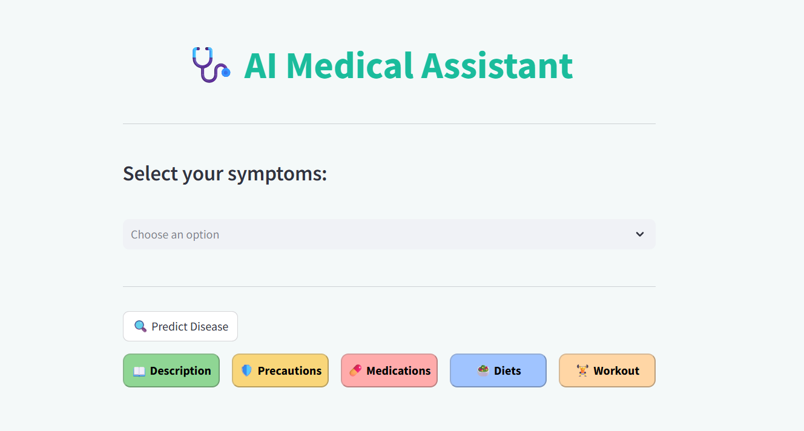
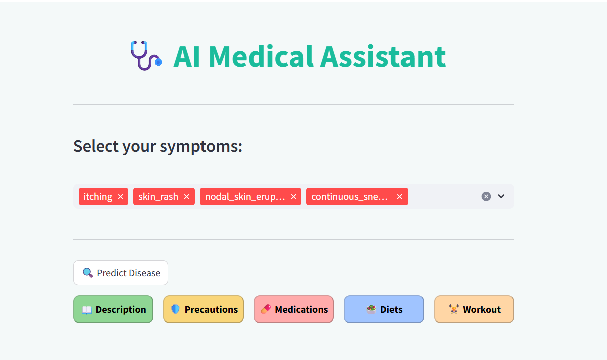
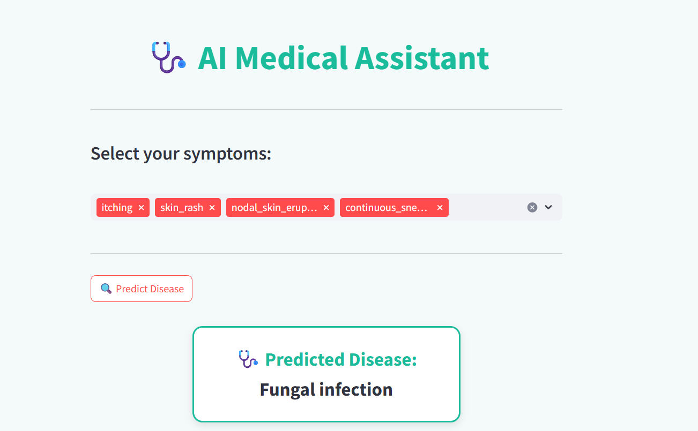
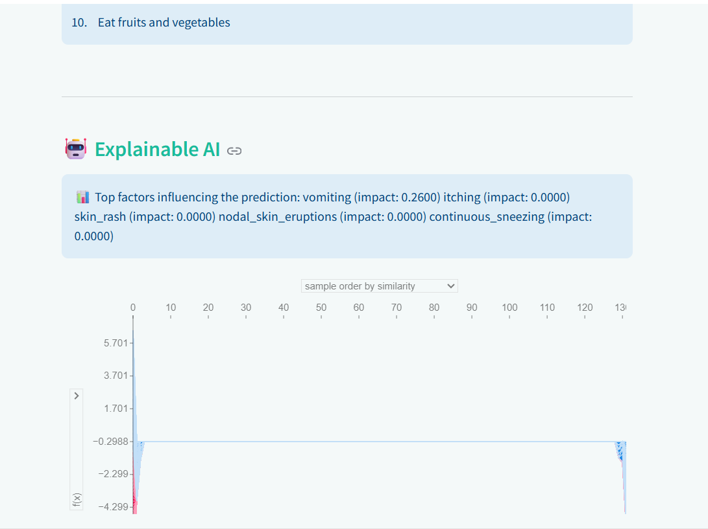

# AI Medical Assistant

This project is a web application that predicts diseases based on user symptoms and provides personalized recommendations. It also includes Explainable AI visualizations.

## Features
-  Disease prediction using a trained **Support Vector Classifier (SVC)** model  
-  **Explainable AI (SHAP)** to show which symptoms influenced predictions  
-  Recommendations for:
  - Medications  
  - Precautions  
  - Diet suggestions  
  - Workout tips  
-  Simple **Streamlit web app** for user interaction  

---

## Project Structure  

```

SmartHealth\_AI\_Prediction\_Recommendation\_System/
│
├── app.py                # Main Streamlit app
├── utils.py              # Helper functions (prediction, SHAP, recommendations)
├── svc\_model.pkl         # Trained ML model
├── Datasets/             # CSV files (symptoms, medications, diets, workouts, etc.)
├── ai\_medical\_assistant.ipynb   # Jupyter notebook for training & experiments
└── README.md             # Project documentation

````

---

## ⚙️ Installation & Usage  

1. Clone this repository:  
   ```bash
   git clone https://github.com/yourusername/SmartHealth_AI_Prediction.git
   cd SmartHealth_AI_Prediction
````

2. Install dependencies:

   ```bash
   pip install -r requirements.txt
   ```

3. Run the app:

   ```bash
   streamlit run app.py
   ```

4. Open the link shown in the terminal .

---

##  Example Workflow

1. Select your symptoms in the app.
2. The model predicts the most likely disease.
3. **Explainable AI (SHAP):** a plot will be displayed showing the contribution of each symptom to the prediction.

   * Positive values → increase probability of the disease
   * Negative values → decrease probability of the disease
4. The system suggests **precautions, diets, medications, and workouts** related to that disease.

---

## Explainable AI (SHAP)

This project integrates **SHAP (SHapley Additive exPlanations)** to make predictions more transparent.

* After prediction, users can display a **SHAP plot**.
* The plot highlights which symptoms were most influential in the decision.

Example SHAP insights:

* Symptom A → strong positive influence (+0.45)
* Symptom B → medium influence (+0.22)
* Symptom C → negative influence (-0.18)

This makes the project not only predictive but also **interpretable**, which is important in healthcare-related AI.

---

## Learning Goals

Through this project, I practiced:

* Training and evaluating a **classification model**
* Using **Explainable AI (SHAP)** to understand model predictions
* Building a **Streamlit interface** for end-users
* Cleaning and processing messy **medical datasets**

---

## Project Screenshots

Here is a preview of the **AI Medical Assistant** app:

---

### 1. Enter Symptoms  
Select one or more symptoms from the dropdown list.  



---

### 2. Predict Disease  
Click the **“🔍 Predict Disease”** button.  
The system will analyze your symptoms and display the predicted disease.  



---

### 3. View Recommendations  
Choose one of the recommendation categories (e.g., **Workout**, **Diet**, **Medications**, etc.).  
The selected section will expand below and display the recommendations in a **color-highlighted format**.  



---

### 4. Explainable AI  
Scroll down to the **Explainable AI** section to see:  
- A SHAP visualization of how symptoms contributed to the prediction.  
- A textual explanation of the model’s reasoning.  


